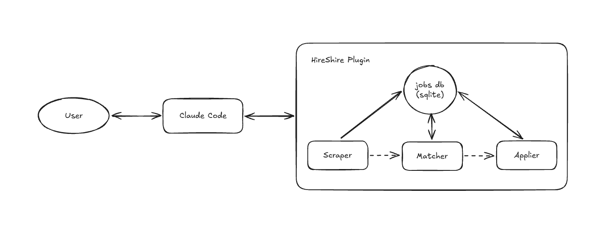

# HireShire Plugin

Automated job search on your own Claude subscription.

## 1. Prerequisites

- A Claude subscription
- An optimized, refined resume, in a new folder
- ~3 GB of free disk space

## 2. Install and set up

1. Start a Claude Code session from that folder.
2. Install the plugin and setup:
   ```
   /plugin marketplace add slowloris-98/HireShire-plugin

   /plugin install hireshire@hireshire 
   (install for you)
   
   /hireshire:setup
   ```

`/hireshire:setup` will ask your preferences for the run (~15 min).

## 3. Run HireShire

Start Hireshire from a claude session in a folder with your resume.

```
/hireshire:start-orchestration
```

The sweep's status and your shortlisted jobs are here:

**Windows**
```
All sweeps:  C:\Users\<you>\<job-search-folder>\hireshire_run_results\overview.html
One sweep:   C:\Users\<you>\<job-search-folder>\hireshire_run_results\<YYYY-MM-DD_HHMMSS>\<YYYY-MM-DD_HHMMSS>_overview.html
```

**macOS**
```
All sweeps:  ~/<job-search-folder>/hireshire_run_results/overview.html
One sweep:   ~/<job-search-folder>/hireshire_run_results/<YYYY-MM-DD_HHMMSS>/<YYYY-MM-DD_HHMMSS>_overview.html
```

Full details: [docs/SPECS.md](docs/SPECS.md)

## 4. System architecture


