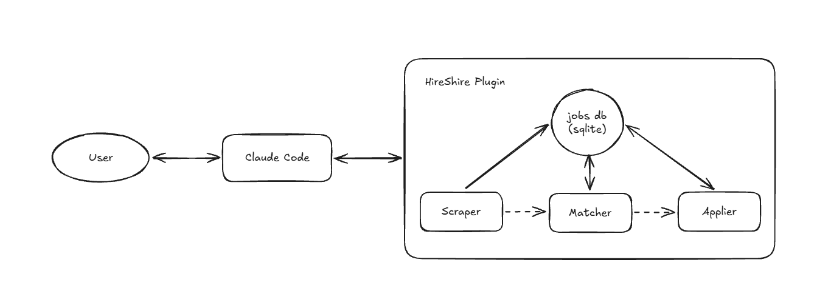

# HireShire Plugin

Automated job search on your own Claude subscription.

## 1. Prerequisites

- Claude / Codex / API for judging and matching the jobs (recommended but not necessary — HireShire can still
  scrape thousands of jobs and rank without scoring and applying; see [section 5](#5-no-claude--codex--api-subscription))
- An optimized, refined resume, in a new folder
- ~3 GB of free disk space

## 2. Install and set up

1. Start a Claude Code session from that folder.
2. Install the plugin and setup:
   ```
   /plugin marketplace add slowloris-98/HireShire-plugin
   ```

   ```
   /plugin install hireshire@hireshire 
   ```
   (select install for you)

   ```
   /hireshire:setup
   ```

   `setup` will ask your preferences for the run (~15 min).

## 3. Run HireShire

Start Hireshire from a claude session in a folder with your resume.

```
/hireshire:start-orchestration
```

The sweep's status and your shortlisted jobs are here:

**Windows**
```
All sweeps:  C:\Users\<you>\<job-search-folder>\hireshire_run_results\Dashboard_Lifetime.html
One day:     C:\Users\<you>\<job-search-folder>\hireshire_run_results\<YYYY-MM-DD>\Dashboard_Day_<YYYY-MM-DD>.html
One sweep:   C:\Users\<you>\<job-search-folder>\hireshire_run_results\<YYYY-MM-DD>\<YYYY-MM-DD_HHMMSS>\Dashboard_<YYYY-MM-DD_HHMMSS>.html
```

**macOS**
```
All sweeps:  ~/<job-search-folder>/hireshire_run_results/Dashboard_Lifetime.html
One day:     ~/<job-search-folder>/hireshire_run_results/<YYYY-MM-DD>/Dashboard_Day_<YYYY-MM-DD>.html
One sweep:   ~/<job-search-folder>/hireshire_run_results/<YYYY-MM-DD>/<YYYY-MM-DD_HHMMSS>/Dashboard_<YYYY-MM-DD_HHMMSS>.html
```

Full details: [docs/SPECS.md](docs/SPECS.md)

## 4. System architecture



## 5. No Claude / Codex / API subscription?

HireShire can still scrape thousands of jobs and rank them locally — no auto-apply, no LLM
job scoring. See [Readme_Manual_Setup.md](Readme_Manual_Setup.md).
