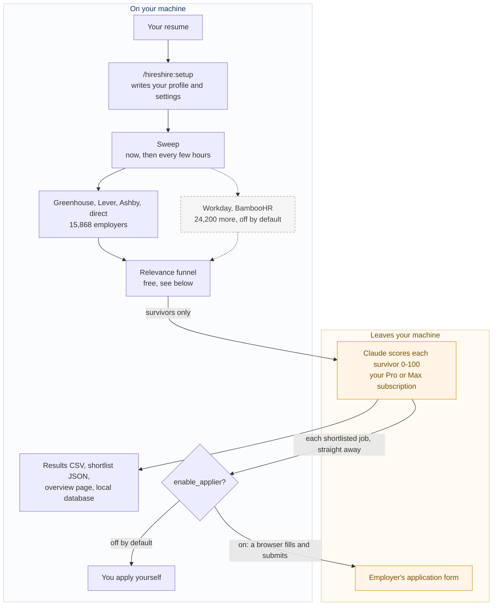
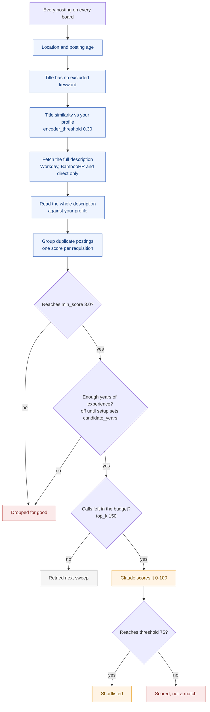

# System architecture

How a job gets from a company's careers page to your shortlist.

See the [specs](SPECS.md) for install and settings, and `CLAUDE.md` for the
file-level internals.

## The whole flow

Everything runs on your machine except scoring. The sweep and the funnel never send
anything out; only the jobs that survive the funnel are sent to Claude, each with
your resume so it can be judged against it, on your own subscription. (With the
`codex` provider the judge is an OpenAI model on your ChatGPT plan instead, called
through the local Codex CLI the same way.)

## The funnel

Blue stages run locally and cost nothing; only the orange one spends quota. That is
why `min_score`, the gate directly in front of it, is the lever that controls what a
sweep costs — tightening the title gate saves CPU, not calls.

**The drops are not all the same.** Below `min_score`, or asking for more experience
than you have, is a verdict — the same job, profile and settings give the same answer
every time, so it is retired and will not come back. Out of budget is a deferral —
nothing was decided, so it returns next sweep.

## Tuning

| Setting | Default | Raise it to |
|---|---:|---|
| `encoder_threshold` | 0.30 | skip more titles before any description is fetched |
| `min_score` | 3.0 | send fewer, better-matched jobs for scoring |
| `top_k` | 150 | allow more scoring calls per sweep |
| `candidate_years` | 0 (gate off) | keep postings that ask for more experience |
| `threshold` | 75 | shortlist only stronger matches |

An empty shortlist with a large "reranked" count but almost nothing "above cutoff" in
the run summary means `min_score` is too high for your resume, not that there were no
good jobs.
